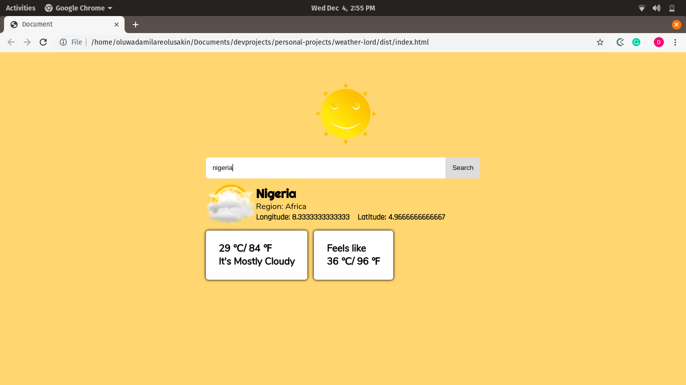

# Weather Lord
A weather application written in ES6, using webpack to manage my modules and fetching data from [Aries Weather's API](https://www.aerisweather.com).

# What it does
It allows users make requests for weather data in various countries. You can view temperature and general weather details.

## Built With

- JS(ES6), using promises for async requests
- Webpack `style-loader`, `node-sass`, `sass-loader` and `url-loader`
- Aries Weather's API

## Live Demo

[Live Demo](https://rawcdn.githack.com/Oluwadamilareolusakin/weather-lord/2f59652472dbd387bc29a39063ba1000eb4c6358/dist/index.html)

## Getting Started

To get a local copy up and running follow these simple example steps.
- Clone the project unto your local machine
- Navigate into `/views` and open up the `.html` file

## 🤝 Contributing

Contributions, issues and feature requests are welcome!

Feel free to check the [issues page](https://github.com/Oluwadamilareolusakin/javascript-to-do-list/issues).

## Show your support

Give a ⭐️ if you like this project!

## 📝 License

This project is [MiT](lic.url) licensed.

Check out my stories on [medium](https://medium.com/@oluwadamilareo_) to see what I'm talking about!
Follow me on [Instagram](https://instagram.com/oluwadamilare_olusakin) and [Twitter](https://twitter.com/oluwadamilareo_) to see what I am up to!
### Enjoy!
